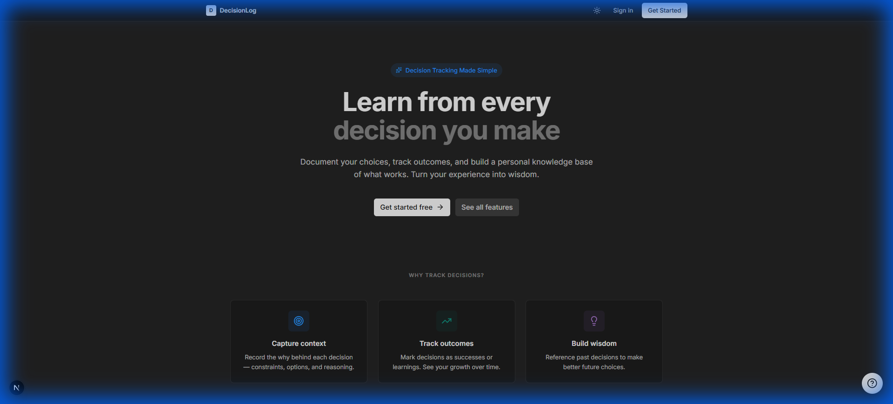
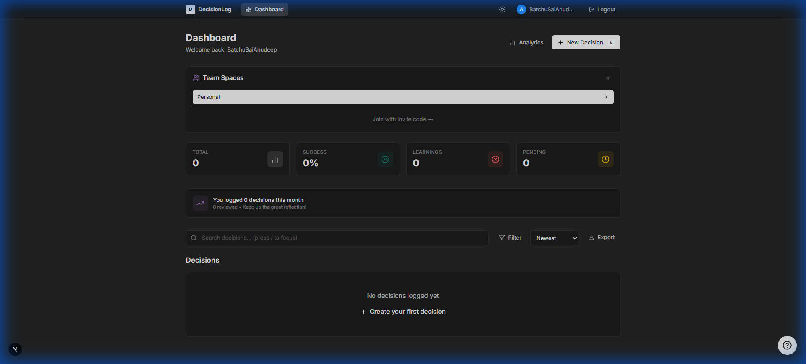
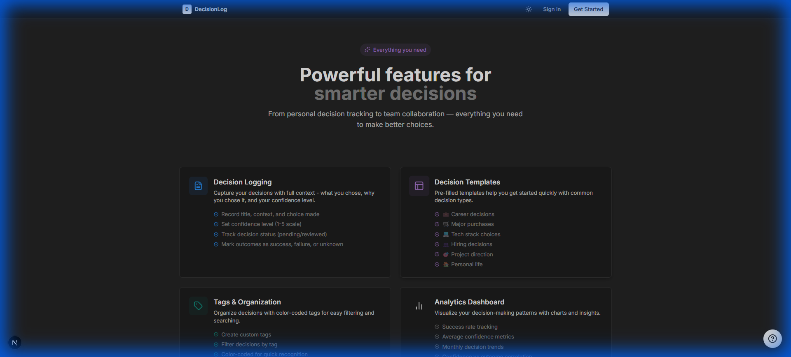
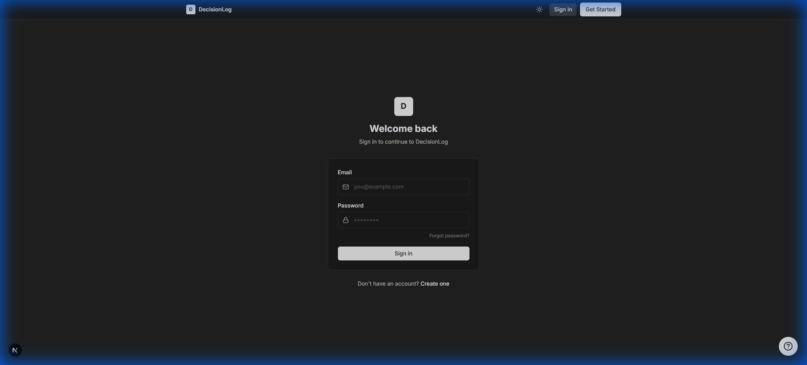

# DecisionLog

A modern, full-stack decision tracking web application built with **Next.js** and **FastAPI** to help individuals and teams log, track, and learn from their decisions.

   

---

## 📸 Screenshots

### Homepage


### Dashboard


### Features Page


### Login Page


---

## 🚀 Features

### Core Features
- ✅ **User Authentication** - Secure JWT-based login/registration with password reset
- ✅ **Decision CRUD** - Create, read, update, delete decisions with full context
- ✅ **Dashboard** - View all decisions with search, filter, and sort capabilities
- ✅ **Protected Routes** - Authentication required for dashboard access

### Advanced Features
- 🏷️ **Tags** - Organize decisions with color-coded tags
- 📊 **Analytics** - Visual charts for success rate, confidence trends
- 📋 **Templates** - 6 pre-filled templates for common decision types
- 👥 **Team Spaces** - Collaborate on decisions with invite codes
- ✅ **Voting** - Team approve/reject/abstain votes
- 💬 **Comments** - Follow-up notes on decisions
- 📰 **Activity Feed** - Real-time team activity stream
- 🌙 **Dark Mode** - Theme toggle with system preference respect
- ❓ **Interactive Help** - Built-in tour for new users

---

## 🛠️ Tech Stack

| Layer | Technology |
|-------|------------|
| Frontend | Next.js 14, React, TypeScript |
| Styling | TailwindCSS, Custom CSS Variables |
| Backend | FastAPI (Python) |
| Database | PostgreSQL (Supabase) |
| Auth | Supabase Auth (JWT) |
| Hosting | Vercel (Frontend), Any Python host (Backend) |

---

## 📦 Installation

### Prerequisites
- Node.js 18+
- Python 3.9+
- Supabase account

### 1. Clone the repository
```bash
git clone https://github.com/anudeep2710/DecisionLog.git
cd DecisionLog
```

### 2. Set up the Frontend
```bash
cd frontend
npm install
```

Create `frontend/.env.local`:
```env
NEXT_PUBLIC_SUPABASE_URL=your_supabase_url
NEXT_PUBLIC_SUPABASE_ANON_KEY=your_anon_key
```

### 3. Set up the Backend
```bash
cd backend
python -m venv venv
venv\Scripts\activate  # Windows
# source venv/bin/activate  # Mac/Linux
pip install -r requirements.txt
```

Create `backend/.env`:
```env
SUPABASE_URL=your_supabase_url
SUPABASE_KEY=your_service_role_key
```

### 4. Set up Supabase Database
Run the SQL in `supabase_schema.sql` in your Supabase SQL Editor.

### 5. Run the Application
```bash
# Terminal 1 - Backend
cd backend
venv\Scripts\python main.py

# Terminal 2 - Frontend
cd frontend
npm run dev
```

Access at: http://localhost:3000

---

## 📡 API Documentation

### Base URL
```
http://localhost:8000
```

### Authentication
All protected endpoints require Bearer token:
```
Authorization: Bearer <jwt_token>
```

### Endpoints

| Method | Endpoint | Description |
|--------|----------|-------------|
| GET | `/decisions/` | Get all user decisions |
| POST | `/decisions/` | Create a decision |
| PUT | `/decisions/{id}` | Update a decision |
| DELETE | `/decisions/{id}` | Delete a decision |
| GET | `/teams/` | Get user's teams |
| POST | `/teams/` | Create a team |
| POST | `/teams/join` | Join team by code |
| GET | `/tags/` | Get all tags |
| POST | `/tags/` | Create a tag |
| GET | `/comments/decision/{id}` | Get decision comments |
| POST | `/comments/` | Add a comment |
| GET | `/votes/decision/{id}` | Get vote summary |
| POST | `/votes/` | Cast a vote |

📁 **Postman Collection**: `DecisionLog_API.postman_collection.json`

---

## 🔐 Security Features

- **Password Hashing**: Handled by Supabase (bcrypt)
- **JWT Authentication**: Token-based auth with Supabase
- **Protected Routes**: Middleware checks auth on frontend
- **Row Level Security**: Database-level access control
- **Input Validation**: Pydantic models on backend
- **CORS Configuration**: Restricted to allowed origins

---

## 📈 Scaling Strategy

### Current Architecture
```
┌─────────────┐     ┌─────────────┐     ┌─────────────┐
│   Next.js   │────▶│   FastAPI   │────▶│  Supabase   │
│  (Vercel)   │     │  (Backend)  │     │ (PostgreSQL)│
└─────────────┘     └─────────────┘     └─────────────┘
```

### Production Scaling Recommendations

#### 1. **Horizontal Scaling**
```
                    ┌─────────────┐
                    │   Load      │
                    │  Balancer   │
                    └──────┬──────┘
           ┌───────────────┼───────────────┐
           ▼               ▼               ▼
    ┌───────────┐   ┌───────────┐   ┌───────────┐
    │  FastAPI  │   │  FastAPI  │   │  FastAPI  │
    │ Instance 1│   │ Instance 2│   │ Instance 3│
    └───────────┘   └───────────┘   └───────────┘
           │               │               │
           └───────────────┼───────────────┘
                           ▼
                    ┌─────────────┐
                    │  Supabase   │
                    │  (Pooler)   │
                    └─────────────┘
```

#### 2. **Caching Layer**
- Add **Redis** for session/token caching
- Cache frequent queries (user profile, tags)
- Implement response caching for analytics

#### 3. **Database Optimization**
- Use **Supabase Connection Pooler** (PgBouncer)
- Add indexes on frequently queried columns
- Implement pagination for large lists

#### 4. **CDN & Static Assets**
- Serve frontend via **Vercel Edge Network**
- Use **Supabase Storage** for file uploads
- Optimize images with Next.js Image component

#### 5. **Microservices (Future)**
```
┌──────────────────────────────────────────────────┐
│                  API Gateway                      │
└──────────────────────────────────────────────────┘
       │           │           │           │
       ▼           ▼           ▼           ▼
┌───────────┐┌───────────┐┌───────────┐┌───────────┐
│  Auth     ││ Decisions ││   Teams   ││ Analytics │
│  Service  ││  Service  ││  Service  ││  Service  │
└───────────┘└───────────┘└───────────┘└───────────┘
```

---

## 📁 Project Structure

```
DecisionLog/
├── frontend/
│   ├── app/                    # Next.js pages
│   │   ├── dashboard/          # Protected dashboard
│   │   ├── login/              # Auth pages
│   │   ├── register/
│   │   ├── analytics/
│   │   └── features/
│   ├── components/             # Reusable components
│   │   ├── Navbar.tsx
│   │   ├── DecisionForm.tsx
│   │   ├── TagSelector.tsx
│   │   ├── VotingPanel.tsx
│   │   └── HelpTour.tsx
│   └── lib/                    # Supabase client
│
├── backend/
│   ├── main.py                 # FastAPI entry point
│   ├── auth.py                 # JWT authentication
│   └── routers/                # API routes
│       ├── decisions.py
│       ├── teams.py
│       ├── tags.py
│       ├── comments.py
│       └── votes.py
│
├── supabase_schema.sql         # Database schema
└── DecisionLog_API.postman_collection.json
```

---

## 👨‍💻 Author

**Anudeep Batchu**

---

## 📄 License

MIT License - feel free to use this project for learning and development.
