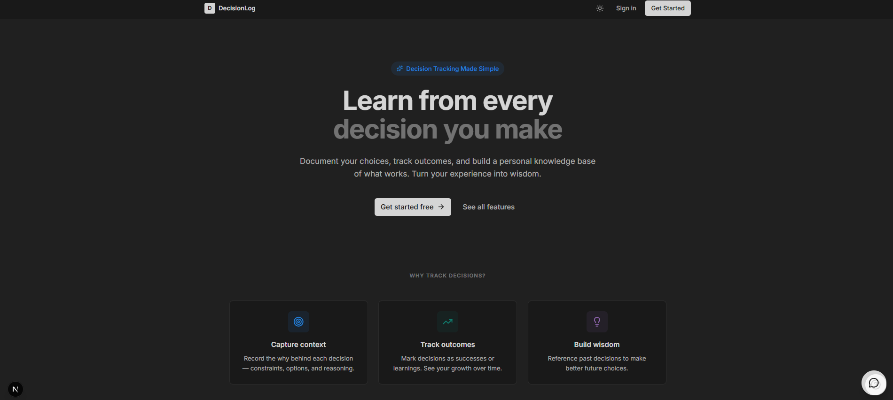
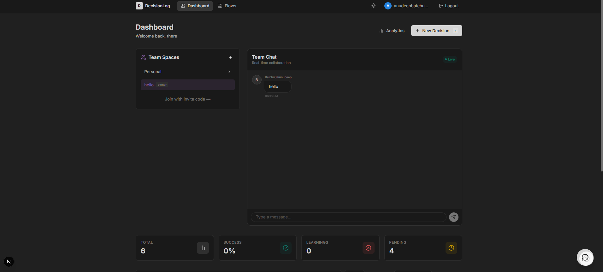

# DecisionLog

DecisionLog is a comprehensive decision tracking and collaboration platform designed to help teams and individuals document, analyze, and reflect on their decision-making processes. It combines structured data logging with visual whiteboarding and real-time collaboration tools.

   

---

## Application Screenshots

### Homepage


### Dashboard


### Team Chat


### Analytics Dashboard


### Decision Flow


### Authentication


---

## Key Features

### Core Functionality
- **Secure Authentication**: Local JWT-based system with protected route management.
- **Decision Management**: Full CRUD operations for detailed decision records.
- **Interactive Dashboard**: Centralized view with advanced filtering and search.
- **Kanban Workflow**: Drag-and-drop status management (To Do, In Progress, Review, Done).
- **Visual Whiteboard**: SVG-based tool for mapping decision flows and logic.

### Collaboration & Organization
- **Team Spaces**: Dedicated workspaces for team collaboration.
- **Real-time Chat**: Integrated messaging for immediate team communication.
- **Decision Voting**: structured approval workflows (Approve, Reject, Abstain).
- **Comments**: Contextual discussion threads on individual decisions.
- **Activity Feed**: chronological stream of team actions and updates.

### Intelligence & Insights
- **Advanced Analytics**: Data visualization for success rates, confidence levels, and workflow throughput.
- **AI Assistant**: Intelligent chatbot for querying decision history and patterns.
- **Smart Templates**: Pre-configured structures for common decision types.

### User Experience
- **Dark Mode**: Fully adaptive theme support.
- **Interactive Onboarding**: Guided tour for new user orientation.

---

## Technology Architecture

| Component | specification |
|-----------|---------------|
| **Frontend** | Next.js 14, React, TypeScript |
| **Styling** | TailwindCSS, CSS Modules |
| **Backend** | FastAPI (Python 3.9+) |
| **Database** | SQLite (SQLAlchemy ORM) |
| **Security** | OAuth2 with JWT, BCrypt Hashing |
| **Architecture** | RESTful API, Client-Side Rendering |

---

## Installation Guide

### Prerequisites
- Node.js 18 or higher
- Python 3.9 or higher

### 1. Repository Setup
```bash
git clone https://github.com/anudeep2710/DecisionLog.git
cd DecisionLog
```

### 2. Backend Configuration
Navigate to the backend directory and initialize the environment:
```bash
cd backend
python -m venv venv
# Activate Virtual Environment
# Windows:
venv\Scripts\activate
# Mac/Linux:
# source venv/bin/activate
```

Install dependencies:
```bash
pip install -r requirements.txt
```

### 3. Start Backend Server
```bash
venv\Scripts\python main.py
```
The server will initialize at `http://localhost:8000`. The SQLite database is automatically generated on the first run.

### 4. Frontend Configuration
Open a new terminal session and navigate to the frontend directory:
```bash
cd frontend
npm install
```

### 5. Start Application
```bash
npm run dev
```
The application will be accessible at `http://localhost:3000`.

---

## API Documentation

### Base Configuration
**Base URL**: `http://localhost:8000`

**Authentication**: Bearer Token required for all protected endpoints.

### Primary Endpoints

| Method | Resource | Description |
|--------|----------|-------------|
| **GET** | `/decisions/` | Retrieve user/team decisions |
| **POST** | `/decisions/` | Create new decision record |
| **PUT** | `/decisions/{id}` | Update decision details |
| **GET** | `/teams/` | List associated teams |
| **POST** | `/teams/join` | Join team via invite code |
| **GET** | `/whiteboards/` | Retrieve all whiteboard sessions |
| **POST** | `/whiteboards/` | Initialize new whiteboard |
| **POST** | `/chat/` | Send team message |
| **POST** | `/bot/query` | Query AI assistant |

Full API specification available in `DecisionLog_API.postman_collection.json`.

---

## Security Implementation

- **Password Storage**: SHA256-Crypt hashing via Passlib.
- **Session Management**: Stateless JWT (JSON Web Tokens) with expiration.
- **Access Control**: Role-based access logic for Team and Personal scopes.
- **Data Safety**: Pydantic schema validation and parameterized queries.

---

## Project Structure

```
DecisionLog/
├── frontend/             # Next.js Application
│   ├── app/              # App Router Pages
│   ├── components/       # UI Components
│   └── lib/              # Utility Functions
│
├── backend/              # FastAPI Server
│   ├── routers/          # API Route Controllers
│   ├── models.py         # Database Schema
│   └── auth.py           # Security Logic
│
└── screenshots/          # Application Visuals
```

---

## Production & Scaling Strategy

### Frontend Scaling
- **Edge Deployment**: Leverage Vercel's Global Edge Network to serve static assets (JS, CSS, Images) from the node closest to the user, minimizing latency.
- **Static Site Generation (SSG)**: Pre-render marketing and public pages to reduce server load and improve Time-to-First-Byte (TTFB).
- **Asset Optimization**: Use Next.js `<Image>` component for automatic resizing and WebP conversion to reduce bandwidth usage.

### Backend Scaling
- **Horizontal Scaling**: Deploy the FastAPI application across multiple containers/nodes behind a Load Balancer (e.g., NGINX or AWS ALB) to interpret concurrent requests.
- **Asynchronous Processing**: Offload heavy computational tasks (like AI queries or complex analytics) to a task queue (Celery + Redis) to keep the main API responsive.
- **Connection Pooling**: Implement PgBouncer to manage database connections efficiently, preventing connection exhaustion under high load.

### Database Evolution
- **Migration to PostgreSQL**: Move from SQLite to a managed PostgreSQL instance (e.g., AWS RDS, Supabase, or Railway) to support concurrent writes and complex queries.
- **Read Replicas**: Separate Read/Write operations. Direct analytical queries to Read Replicas to ensure the primary database remains performant for transactional user actions.
- **Caching Layer**: Implement Redis for caching frequently accessed data (e.g., user profiles, common decision templates) to reduce database hits.

---

**Author**: Anudeep Batchu
